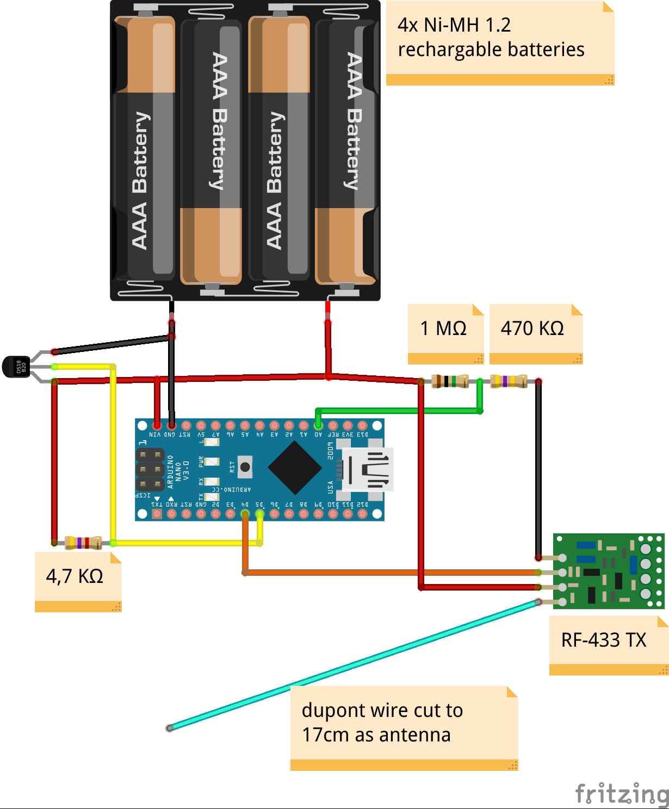

# Batt-LP-RF433-ds18b20
Battery powered Arduino nano featuring 433 MHz TX with ds18b20 temperature sensor

This repo is based on the [rfbox-ds18b20.ino](https://github.com/incmve/generic-rfbox/blob/development/Sketches/rfbox-ds18b20.ino) from the generic rf-box by incmve: https://github.com/incmve/generic-rfbox, which is again based on the [generic 433 sender](https://github.com/Yves911/generic_433_sender) from Yves Grange. 
Further sources (of information) used:
- http://www.mysensors.org/build/battery
- http://provideyourown.com/2012/secret-arduino-voltmeter-measure-battery-voltage/
- https://code.google.com/p/tinkerit/wiki/SecretVoltmeter

What has been added:
- The Rocket Stream Low power library: https://github.com/rocketscream/Low-Power
- Battery measurement

This repo consists of two sketches:
- One without battery measurement: [rfbox-ds18b20-LP.ino](rfbox-ds18b20-LP.ino)
- One with battery measurement: [rfbox-ds18b20-LP-Voltage.ino](rfbox-ds18b20-LP-Voltage.ino)

Please note that this is definitely not a "state of the art" sketch but it works and can be a possible source of information for you.

To reduce further power draining components I wanted to remove the power led. However when trying to remove it with pliers I broke the led but it had the same effect. The Arduino nano still worked and the power use was reduced.

Schema below: 
(Everything is added to a breadboard but that made the schema less readable) 

For the version without battery measurement: Simply remove the 1 MΩ and 470 KΩ resistors and the connection to A0 from the schema.
